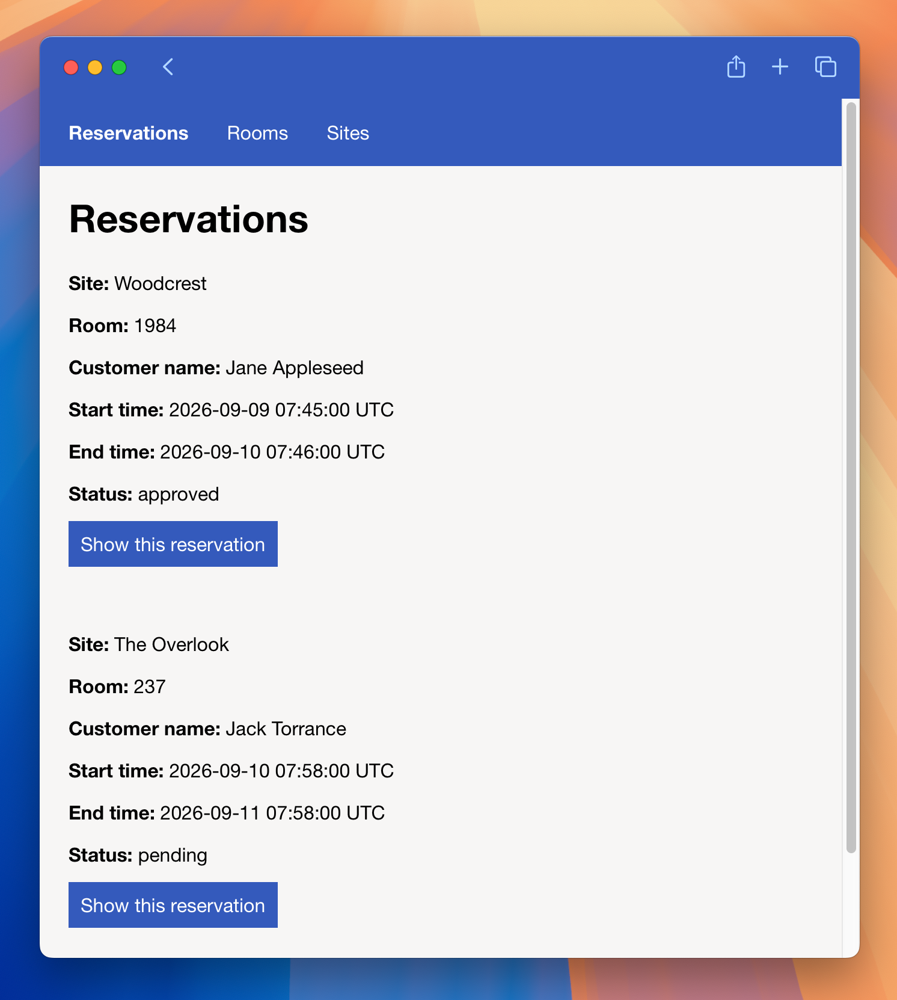
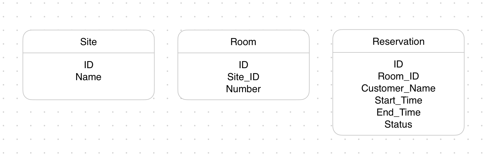

# Room Reservation System Challenge
A lightweight Ruby on Rails application for managing room reservations. 

---

## Scope Decisions
* For the sake of time, cut the idea for different user roles having different permissions. 

## What To Do Next
* Authentication and Permissions: Implement user login and permissions to distinguish between staff and admin. 
* UI: More styles and formatting work to make the app more user-friendly. 
* Times presented in the local time zone instead of UTC. 

## AI Usage Log
* AI didn't write any code but I consulted with Gemini to walk me through or point me in the right direction with specific Ruby and Rails concepts such as form helpers, validation, routing. 